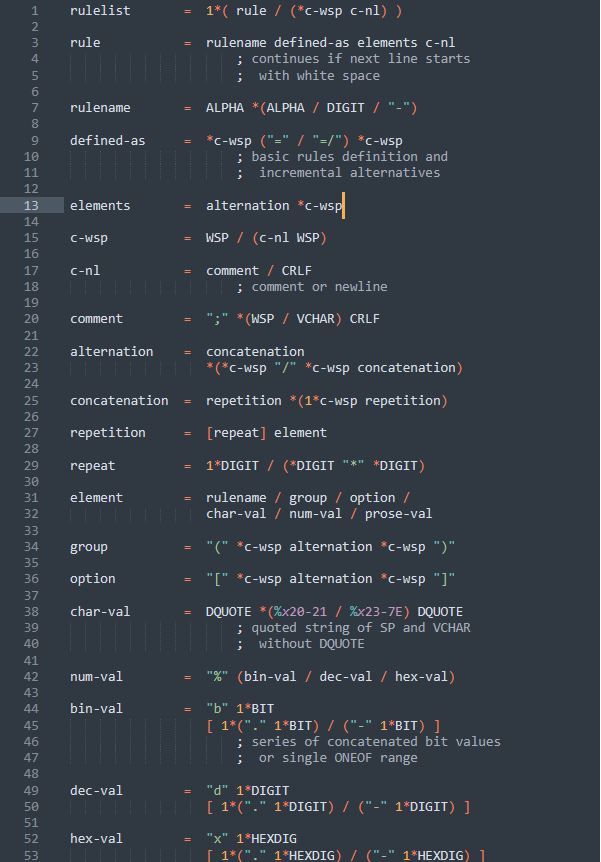

# A-BNF  

### Writing A-BNFs by using Sublime Text  

You need to follow the steps below:  

1. Download the `abnf.sublime-syntax`.  
2. Goto the path of the data of your Sublime Text. (`User/$username/AppData/Roaming/Sublime Text/Packages/User/`) 
3. Paste the file in it.  

Then, open Sublime Text and choose `A-BNF`.  
Now, you can write your own A-BNFs.  

  
